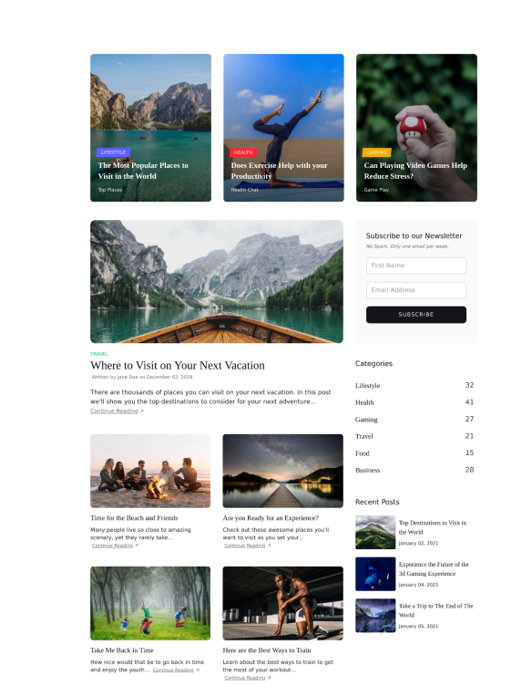
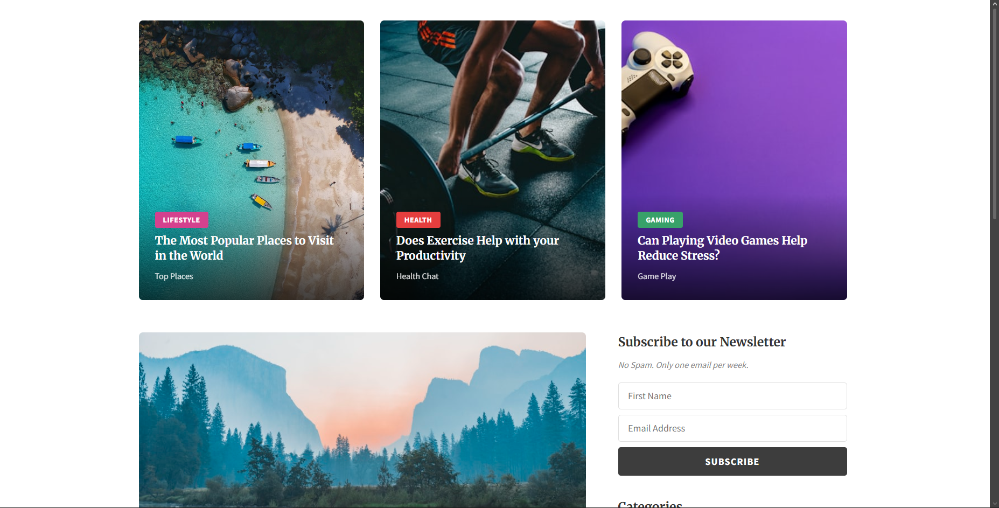
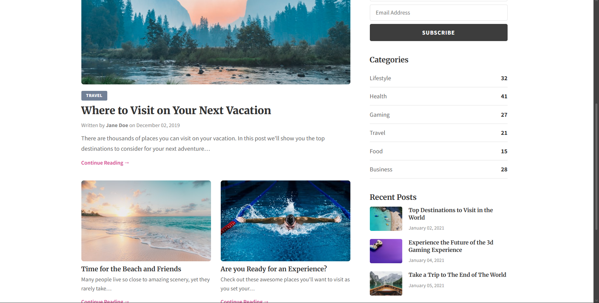
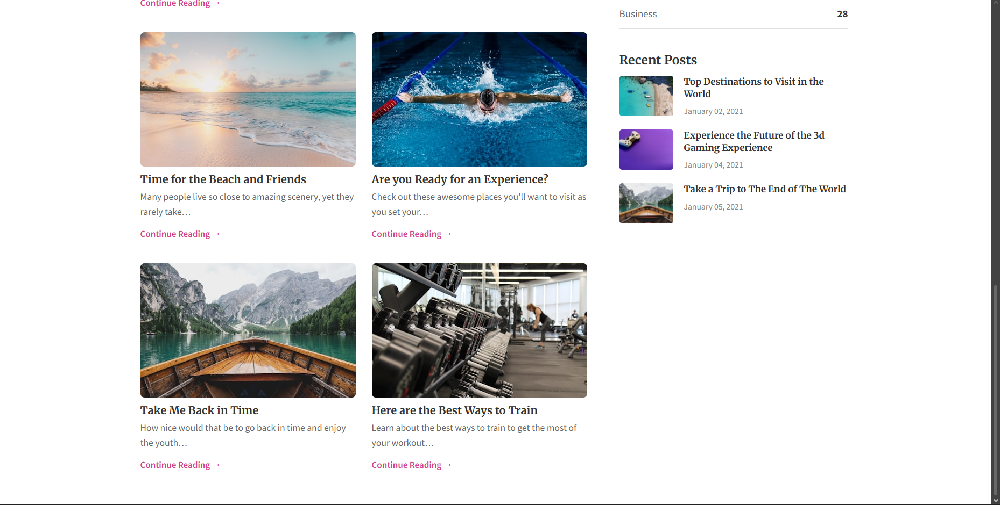

# Tarea 1 - Clon de Sección de Sitio Web

**Estudiante:** Manuel Guzmán G.

**Curso:** Multimedios — HTML & CSS

## Sitio clonado

Blog de viajes (Travel Blog) — sección principal con tarjetas hero, posts destacados, sidebar con newsletter, categorías y posts recientes.

## Screenshot del original

## Screenshot del clon

## Tecnologías utilizadas

- HTML semántico
- CSS puro (sin frameworks)
- Google Fonts (Merriweather + Source Sans Pro)
- CSS Grid y Flexbox para el layout